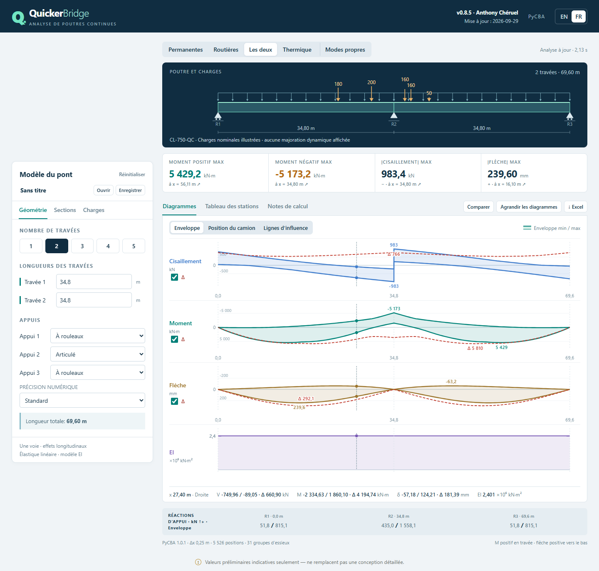
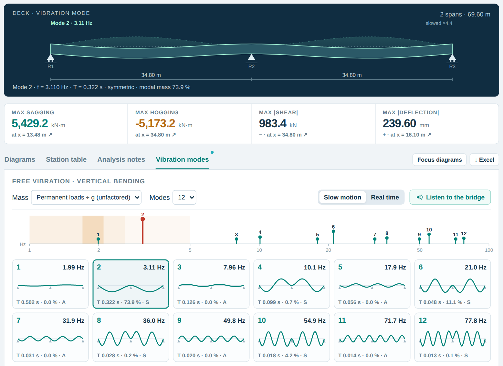
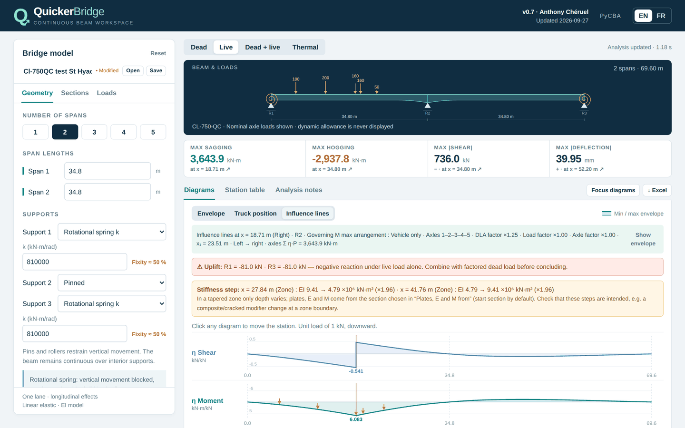
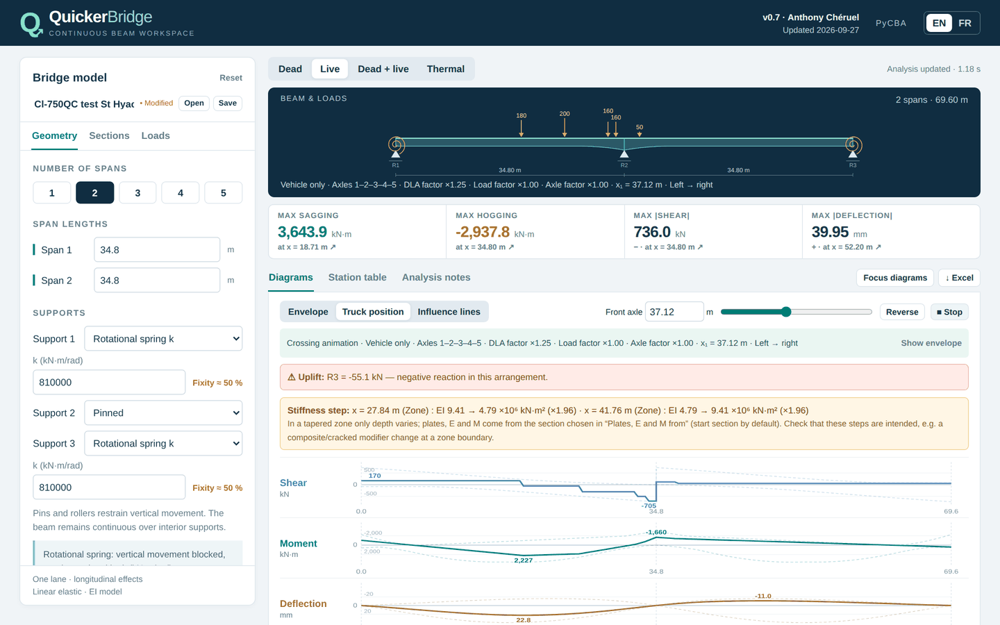
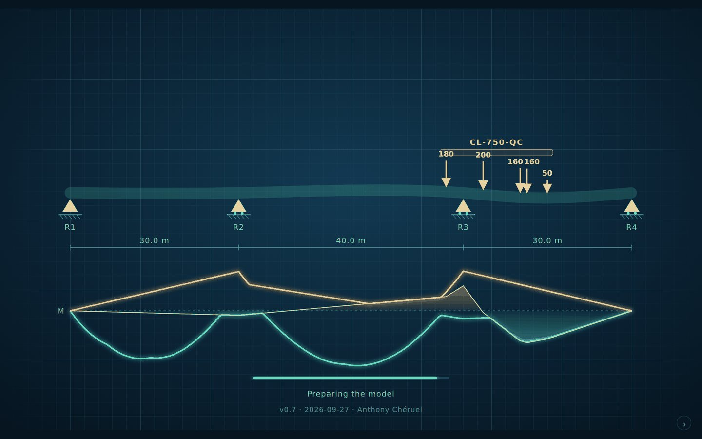

# QuickerBridge

**Preliminary analysis of continuous bridge girders, in your browser.**
Envelopes, influence lines, Canadian and US design trucks, non-prismatic haunches,
integral abutments and thermal gradients — powered by [PyCBA](https://ccaprani.github.io/pycba/)
running locally through WebAssembly. No installation, no server, no data leaves your computer.

**▶ Open the app: https://acfakkoh.github.io/QuickerBridge/**



*Version 0.8 · 2026-09-28 · Anthony Chéruel · [Guide en français](README.fr.md)*

---

## Highlights

| | |
|---|---|
| **Moving-load envelopes** | CL-625, CL-750-QC (MTQ), AASHTO HL-93 truck & tandem, Cooper E, maintenance vehicle, or a custom 1–7 axle vehicle. CAN/CSA S6 dynamic allowance on every axle subset, lane loads over the full deck, load and axle factors. Click any extreme to see the governing truck position. |
| **Influence lines** | V, M and deflection at any station, plus the reaction (and moment reaction) at the nearest support, with the governing axles drawn on the line. |
| **Truck crossing animation** | 60 pre-computed positions of the full vehicle, played back instantly; the envelope stays as a reference. |
| **Supports** | Pinned, roller, **fixed (integral abutment)** or **rotational spring k** with the resulting degree of fixity. Uplift is flagged automatically. |
| **Sections** | Steel I-girders from plate dimensions or direct EI, inertia modifier, non-prismatic zones with linear or parabolic depth, EI(x) diagram and stiffness-step warnings. |
| **Vibration modes** *(v0.8)* | Up to 12 natural frequencies and periods in vertical bending from the same model (non-prismatic EI, integral abutments, springs), mass from the unfactored permanent loads. Animated deck, mode thumbnails, frequency spectrum with pedestrian resonance bands, modal mass — and *Listen to the bridge*. |
| **Thermal gradient** | Linear ΔT through the depth on every span, alone or with integral/spring supports. |
| **Outputs** | Station table, Excel export (FR/EN), `.quickerbridge.json` projects, bilingual interface. |



<table>
<tr>
<td></td>
<td></td>
</tr>
<tr>
<td align="center"><em>Influence lines and governing axles</em></td>
<td align="center"><em>Truck crossing over the envelope</em></td>
</tr>
</table>

## Getting started

- **Web:** open https://acfakkoh.github.io/QuickerBridge/ in a recent Chrome, Edge or Firefox.
- **Offline copy of the page:** download `QuickerBridge-v<version>-<date>.html` from the
  releases (or the repository root) and double-click it. An Internet connection is still
  needed the first time to download the Python runtime.

Start-up is fast: the default model's results are pre-computed and shown as soon as the
short opening animation ends (≈ 3 s — `Esc` skips it). The
calculation engine keeps loading in the background — only NumPy and pydantic (≈ 5 MB);
SciPy is replaced by a verified NumPy subset and matplotlib is not loaded. Excel support
is downloaded on first export.

On restricted company networks, failed or stalled downloads are retried automatically
(up to 4 attempts). If the engine still cannot load, the screen names the blocked step,
library and host (`cdn.jsdelivr.net` for the runtime, `pypi.org` for Excel only) with a
Retry button.



## Scope and sign conventions

Linear-elastic, one-dimensional Euler–Bernoulli continuous beam, one traffic lane,
longitudinal effects only. Sagging moment positive, deflection positive downward,
reactions positive upward, moment reactions counter-clockwise positive. Vibration modes
cover vertical bending of one girder line (no torsion, damping or vehicle-bridge
interaction). No automatic
self-weight, load combinations, transverse distribution, composite section properties,
stresses or code checks.

> **Indicative preliminary values only — not a substitute for detailed design.**
> These tools are intended for learning and preliminary studies and must not be used
> to design a bridge. The author cannot be held liable for their results.

## Validation

468 automated tests (application + vendored PyCBA) compare results with closed-form
solutions: continuous beams, fixed and propped beams, rotational springs, influence lines,
thermal curvature, non-prismatic members, mirror symmetry and natural frequencies
(closed forms and PyCBA `BeamAnalysis.modal`). The application suite also
runs in the browser configuration (no matplotlib, NumPy-only SciPy subset). The CL-750-QC
envelope of the default 2 × 34.8 m bridge matches an independent three-moment solution
to 0.01 %. See [VALIDATION.md](VALIDATION.md) and [NONPRISMATIC.md](NONPRISMATIC.md).

## Development

```bash
python -m venv .venv && . .venv/bin/activate        # Windows: .venv\Scripts\activate
python -m pip install -r requirements.txt
python -m pytest tests vendor/pycba/tests -q          # native suite
QB_MPL_STUB=1 QB_SCIPY_LITE=1 python -m pytest tests -q   # browser configuration
python build_portable.py                              # dist/, portable HTML, release zips
```

`dist/` is the static site published by GitHub Pages (`.github/workflows/pages.yml`, on
every push to `main`). In the repository settings, **Pages → Source** must be set to
**GitHub Actions**. More details in [README_DEVELOPER.md](README_DEVELOPER.md).

## Credits and licence

Built on [PyCBA](https://github.com/ccaprani/pycba) by Colin Caprani (AGPL-3.0-or-later),
vendored with local additions (CL-750-QC, non-prismatic performance); runs on
[Pyodide](https://pyodide.org). See [THIRD_PARTY_NOTICES.md](THIRD_PARTY_NOTICES.md).
