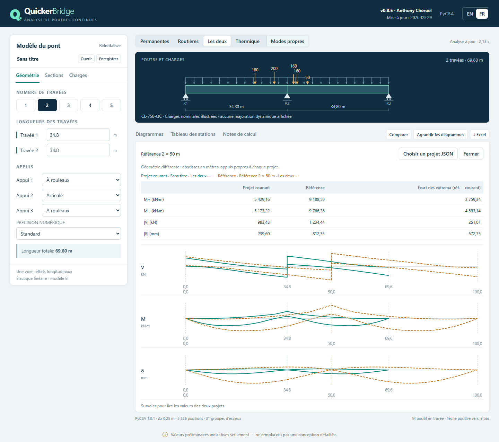

# QuickerBridge

**Preliminary analysis of continuous bridge girders, in your browser.**
Envelopes, influence lines, Canadian and US design trucks, non-prismatic haunches,
integral abutments and thermal gradients — powered by [PyCBA](https://ccaprani.github.io/pycba/)
running locally through WebAssembly. No installation, no server, no data leaves your computer.

**▶ Open the app: https://acfakkoh.github.io/QuickerBridge/**


*Version 0.9.96 · 2026-10-04 · Anthony Chéruel · [Guide en français](README.fr.md)*

---

## Highlights

| | |
|---|---|
| **Moving-load envelopes** | CL-625, CL-750-QC (MTQ), AASHTO HL-93 truck & tandem, Cooper E, maintenance vehicle, or a custom 1–7 axle vehicle. CAN/CSA S6 dynamic allowance on every axle subset, lane loads over the full deck, load and axle factors. Optional HL-93 90% two-truck case for negative moments and interior reactions. Click any extreme to see its governing arrangement; a “Δ ranges” tab replaces V, M, δ by ΔV, ΔM, Δδ = max − min, read with the same cursor. |
| **Influence lines** | V, M and deflection at any station, plus the reaction (and moment reaction) at the nearest support, with the governing axles drawn on the line. |
| **Governing live load** | The arrangement (axles, loaded lane spans or pedestrian spans) of any extreme drawn on the beam, with its V, M and δ diagrams over the faint envelope. |
| **Supports** | Pinned, roller, **fixed (integral abutment)** or **rotational spring k** with the resulting degree of fixity. Any span can be made **simple (isostatic)**, hinged at both ends *(v0.8.6)*. Uplift is flagged automatically. |
| **Sections** | Steel I-girders from plate dimensions, standard **precast prestressed NEBT 1000–1800** girders *(v0.8.6, concrete E 28 GPa by default)* or direct EI, inertia modifier, non-prismatic zones with linear or parabolic depth (steel girders; NEBT bridges stay prismatic), EI(x) diagram and stiffness-step warnings. Girder **self-weight** is added to the permanent loads by default (steel +15%, NEBT +10%, adjustable, can be switched off). |
| **Vibration modes** *(v0.8)* | Up to 12 natural frequencies and periods in vertical bending from the same model (non-prismatic EI, integral abutments, springs), mass from the unfactored permanent loads. Animated deck, mode thumbnails, frequency spectrum with pedestrian resonance bands, modal mass. Six modes and real-time animation by default; optional slow motion. |
| **Truck load fraction FT** *(v0.9–0.9.3)* | CSA S6-25 simplified method for slab-on-girder, solid-slab and voided-slab bridges (per metre of width for slabs, with Be; classes A/B and C/D, CL-625 / CL-750-QC): N, S, Sc, Wc, skew → n, RL, We, μ, DVE (≤ 3.0 m), Le (Figure 5.1, 0.20 (L1+L2) over piers), DT, λ, γc, γe, FT for interior/exterior girders, moment and shear, ULS/SLS1 and FLS/SLS2, with Fs. Choose the girder and limit state; when applied, the whole live load of one lane is multiplied zone by zone (M and δ by the moment FT, V and reactions by the shear FT); exterior girders also get Fs on dead-load shear. Data, definitions and compact tables in the “FT · S6-25” tab; Excel sheet. |
| **Section properties** *(v0.9.3bis)* | Window opened from a steel section card: steel alone (A, centroid, Ix, S, Iy, J, Cw, Zx and plastic neutral axis, S6 section classes), composite 3n and 1n with slab, haunch and two bar layers (I, section moduli at S1–S5 and a user height), effective properties with FrQr, cross-section drawing with neutral axes. *(v0.9.5)* Positive / negative region chosen first: in the negative region the cracked slab is ignored and I′ = steel + bars in tension (no 3n / 1n); y of point S3 set per configuration (steel, 3n, 1n, I′), also for the steel section alone. Display only; a ratio can be copied into the inertia modifier M. *(v0.9.4)* Double-click any diagram (or “σ ↗” in the readout) for the staged stresses over the depth at that station: self-weight and other permanent loads on the steel alone or the 3n section, live envelope max/min on the 1n section, cracked composite section under negative moment. *(v0.9.5)* A “σ Stresses ↗” button and a hover preview next to the envelopes (small stress profile, neutral axes, compression/tension sides); the window lets you change the station (◀ ▶, x, slider) and the S3 height y, and draws each case as one continuous outline from σ = 0 with the dashed neutral axes. |
| **Imposed deformations** | Thermal gradient (linear or bilinear), slab shrinkage or slab creep, each alone, with any supports. |
| **Outputs** | Station table, one formatted Excel workbook including vibration modes and shapes (FR/EN), `.quickerbridge.json` projects, and comparison of two project envelopes on the same metre axis. |




<table>
<tr>
<td></td>
<td></td>
</tr>
<tr>
<td align="center"><em>Influence lines and governing axles</em></td>
<td align="center"><em>Governing truck over the envelope (screenshot from 0.9.8)</em></td>
</tr>
</table>

## Getting started

- **Web:** open https://acfakkoh.github.io/QuickerBridge/ in a recent Chrome, Edge or Firefox.
- **Offline copy of the page:** download `QuickerBridge-v<version>-<date>.html` from the
  releases (or the repository root) and double-click it. An Internet connection is still
  needed the first time to download the Python runtime.

Start-up is fast: the default model's results are pre-computed and shown as soon as the
short opening animation ends (≈ 3 s — `Esc` skips it). The
calculation engine keeps loading in the background — only NumPy and pydantic (≈ 5 MB);
SciPy is replaced by a verified NumPy subset and matplotlib is not loaded. Excel support
is downloaded on first export.

On restricted company networks, failed or stalled downloads are retried automatically
(up to 4 attempts). If the engine still cannot load, the screen names the blocked step,
library and host (`cdn.jsdelivr.net` for the runtime, `pypi.org` for Excel only) with a
Retry button.


## Scope and sign conventions

Linear-elastic, one-dimensional Euler–Bernoulli continuous beam, one traffic lane,
longitudinal effects only. Sagging moment positive, deflection positive downward,
reactions positive upward, moment reactions counter-clockwise positive. Vibration modes
cover vertical bending of one girder line (no torsion, damping or vehicle-bridge
interaction). No automatic
self-weight, load combinations, transverse distribution, composite section properties,
stresses or code checks.

> **Indicative preliminary values only — not a substitute for detailed design.**
> These tools are intended for learning and preliminary studies and must not be used
> to design a bridge. The author cannot be held liable for their results.

## Validation

119 application tests compare results with closed-form
solutions: continuous beams, fixed and propped beams, rotational springs, influence lines,
thermal curvature, non-prismatic members, mirror symmetry and natural frequencies
(closed forms and PyCBA `BeamAnalysis.modal`). The application suite also
runs in the browser configuration (no matplotlib, NumPy-only SciPy subset). The CL-750-QC
envelope of the default 2 × 34.8 m bridge matches an independent three-moment solution
to 0.01 %. See [VALIDATION.md](VALIDATION.md) and [NONPRISMATIC.md](NONPRISMATIC.md).

## Development

```bash
python -m venv .venv && . .venv/bin/activate        # Windows: .venv\Scripts\activate
python -m pip install -r requirements.txt
python -m pytest tests vendor/pycba/tests -q          # native suite
QB_MPL_STUB=1 QB_SCIPY_LITE=1 python -m pytest tests -q   # browser configuration
python build_portable.py                              # dist/, portable HTML, release zips
```

`dist/` is the static site published by GitHub Pages (`.github/workflows/pages.yml`, on
every push to `main`). In the repository settings, **Pages → Source** must be set to
**GitHub Actions**. More details in [README_DEVELOPER.md](README_DEVELOPER.md).

## Credits and licence

Built on [PyCBA](https://github.com/ccaprani/pycba) by Colin Caprani (AGPL-3.0-or-later),
vendored with local additions (CL-750-QC, non-prismatic performance); runs on
[Pyodide](https://pyodide.org). See [THIRD_PARTY_NOTICES.md](THIRD_PARTY_NOTICES.md).

## What's new in 0.9.96

- **Lane load where it increases the effect.** S6 commentary C3.8.4.1: the truck axles and the uniformly distributed load are applied only where they increase the total load effect. The lane UDL now loads, for every response, only the spans whose contribution has the sign sought (new default, "Spans increasing the effect"). Options: "Influence-line parts" (partial spans, where the influence line has that sign) and "Whole bridge" (method up to 0.9.95). The "Governing live load" view draws the loaded spans. Older projects open with the new default.
- **Pedestrian load (S6 3.8.9).** New "Pedestrian load" subsection in Loads, used instead of the vehicle (never both). p = a − s/b kPa between p min and p max, with s the total loaded length; the defaults are those of S6-19 (5 − s/30, 1.6 to 4.0 kPa) until the S6-25 expression is confirmed, and every coefficient is editable. The tributary width is the slab effective width when a slab is defined, else 2000 mm (editable). Every combination of loaded spans (2^n − 1) is evaluated, so the envelope follows the most critical arrangement. Option: envelope with the maintenance vehicle, which is an alternative, never added to the pedestrians. No dynamic allowance, axle factor or FT; the live load factor applies. A click on the diagrams shows the governing arrangement (loaded spans, s, p, w).
- **Names.** "Governing truck" becomes "Governing live load"; the French case tabs read "Vive" and "Permanente + vive". The bilinear gradient is "type B superstructure", 30 °C in the slab by default (was 35). The S6-25 badge is removed from the FT subsection and window titles.
- **FT tables.** Exterior girder shear: one row for FT, then one for FT × Fs (both limit states). Le has two rows: its expression (0,75 L, 0,20 (L1+L2)…) and its numeric application (0,75 × 34,80 = 26,100).
- **Diagram labels.** A plateau (constant shear of an imposed deformation) is labelled once. Moments always show the M+ maximum of every span and the M− at every pier, in the envelope and in Δ ranges; Δ ranges use the same labels as the envelope.
- **Language and Excel.** The interface opens in the browser language (French or English) when no choice was saved. The Excel file name holds the model name, QuickerBridge version and export date; the Model sheet repeats the name and the export date and time.
- **FT flag.** "S6-25 FT applied: values per girder" now sits on the disclaimer line instead of overlapping the beam drawing.

## What's new in 0.9.95

- **Results header as a band.** The five analysis cases (Dead, Live, Dead + live, Imposed deformation, Vibration modes) form one band on top of the beam drawing. The beam drawing keeps only the model name: no heading, no load caption, no section inset. The vibration-mode drawing now has the same length as the others.
- **Display tabs.** Envelope · Δ ranges · Governing truck · Influence lines. Δ ranges is a tab (V, M and δ only, no EI or reactions). Governing truck shows the arrangement of the largest positive moment (click any extreme for another one); the manual position, reverse and animation row is removed. Influence lines no longer repeat the reaction diagram. The "min / max envelope" legend is removed.
- **Peak labels.** Every independent part of the bridge (separated by a simple span or a split pier) shows its own extremes of V, M and deflection, and any peak within 0.5 % of the overall extreme is labelled too, so symmetry is visible at a glance. The four headline values are rounded up, without decimals except one for the deflection.
- **FT in its own window.** "Set FT…" opens a floating window, like the stresses. FT is always computed there; the switch "Apply S6-25 FT to the envelopes" in Loads (off by default) applies it. The zone table has an Fs row. No "DVE limited to 3.0 m" alert.
- **Lighter interface.** No stiffness-step warning or red circles on EI; no uplift warning for the live load alone; examples show their titles only; mode names in the singular. The stress preview on hover is off by default (a box next to "σ Stresses"). "Focus diagrams" is replaced by an arrow that collapses the model panel. The Examples menu opens above every window.
- **Readability and keyboard.** Secondary text, chart scales and series names reach WCAG AA contrast; functional text is at least 11 px. File and Examples menus work with the arrow keys and Escape; tabs and segmented controls expose their state to screen readers; a focused diagram steps through stations with ← → (Shift: 10 stations, Home / End) and reads the values aloud. Flatter surfaces (no gradients or side stripes), the disclaimer inside the results, and "S6-25 FT applied: values per girder" above the headline values when FT is applied.

## What's new in 0.9.9

- **Work protection.** Reset asks first when the model has unsaved changes (save, reset without saving, or cancel). Leaving the page with unsaved changes asks for confirmation. The unsaved model is kept in this browser and offered back at the next start ("Unsaved model found": Restore / Dismiss). Ctrl+Z / Ctrl+Y undo and redo model changes (edits, opened files, examples, reset), also from **File → Undo**.
- **Analysis type apart from the load case.** The results header has two controls: **Static / Vibration modes**, then the four load cases (Dead, Live, Dead + live, Imposed deformation). The load case is kept while the modes are shown. The header wraps instead of overflowing on medium and narrow screens.
- **Clearer errors.** An invalid number shows its message (e.g. the allowed range) right under the field while it is edited. The stress window no longer shows valid station and S3 values as errors. The Excel item says why it is unavailable (engine loading, calculation running, invalid values).

## What's new in 0.9.8

- **Faster.** First analysis of a 6-span non-prismatic bridge about 40 times faster (cached Gauss rule in PyCBA); each live-load update 4 to 5 times faster (every axle subset handled at once, exactly; "axle exactly on a station" positions evaluated for that station only). Envelope differences below 0.01 %. Changes made during an analysis are merged into one update of the latest model, after a wait that adapts to the previous analysis time.
- **Split pier** (Geometry tab, support type): deck joint over a pier with two bearings. The spans on either side are independent; the diagram, the station table and the Excel export give two reactions (L / R).
- **Sections.** Direct EI given as EI, as f′c and γc (computed E) with I, or as E (MPa) and I. NEBT girders: f′c (50 MPa) and γc (24.5 kN/m³) → E shown; γc also scales the self-weight. For a girder with a slab, the analysis inertia can come straight from the 1n, 3n or I′ composite section: M is then computed and greyed out (never applied twice). Default slab 225 mm. An unused section can be removed.
- **Interface.** QuickerUnits-style inputs (thousands separator, decimal comma in French, calculations allowed: `2*17.4`), model name in evidence (also in the beam frame), **File** menu (Open, Save, Compare, Excel; Ctrl+O, Ctrl+S) and **Examples** menu (4 anonymous bridges, FT not applied). The beam sketch names the section of every zone. The imposed-deformation drawings show the actual girder (steel, NEBT or EI).
- FT: the overall width B = (N − 1)·S + 2·Sc is highlighted together with the curb (B − Wc)/2.

## What's new in 0.9.7

- **MTQ automatic fraction (CL-750-QC).** On by default: the 12.6 kN/m lane load goes with the truck at 63 % or 80 % of its axles per response, as in MTQ Info-structures A2023-05 (63 % for M+ outside the M− zones of the supports, shear, single-span bridges and reactions without deck continuity; 80 % for M−, M+ in the M− zones over piers, reactions at continuous piers and deflections). Untick it to choose 63 % or 80 % by hand. The lane load always covers the whole deck (S6 bumper-to-bumper case), as before. Support reactions are now a fifth diagram with arrows at the supports, replacing the table below the diagrams.
- The vehicle always travels in both directions; the "travel direction" option is removed (older files open unchanged).
- Up to 7 spans. The section at the cursor (girder, slab, or an "EI" box) is drawn in the beam frame.
- "Thermal" becomes **Imposed deformation**: thermal gradient (with an illustrated profile), slab shrinkage (250 × 10⁻⁶ by default) and slab creep (ε = φ σc / Ec), each analysed alone, on the long-term k·n composite section (k = 3 by default).
- Stresses: the hover preview shows the top-bar stress in both cases, no slab value, and the M max / M min legend; the full window has a beam sketch with a cursor (click or drag to move the station).

## What's new in 0.9.6

- Audit fixes: the v0.9.5 constant support section is removed (it overrode the non-prismatic zones; older files still open); bars must lie inside the slab; the stress load stages are saved with the project; one project schema (9) for Python and the browser.
- NEBT girders: section properties (tabulated A, I, yb, h; composite with n = Eg/Ec and bars m = Es/Eg; negative region I′) and stress diagrams like steel girders. A bridge with NEBT girders cannot be non-prismatic.
- Stresses: instant hover preview from one all-stations calculation, fixed scale from the bridge extreme tension and compression, values in MPa on the drawing coloured by sign, S1–S5 marked in the full window.
- FT tab always visible, no axle factor by default. Slab FLS shear n ≥ 2 follows each printed table (A/B: 3.20 + 0.10 Le; C/D: 3.20 + 0.10/Le). The Excel FT sheet lists every parameter.
- Diagram readout in the colour of each diagram, values next to the dots; "Method and assumptions" window in the header; explanation of standard vs fine precision.
